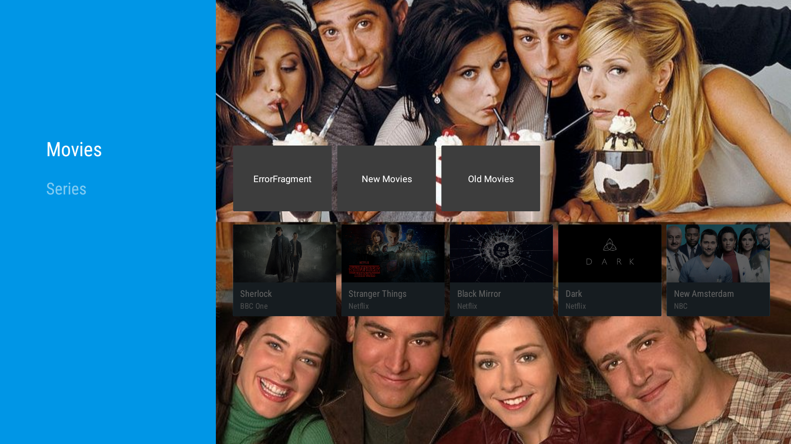
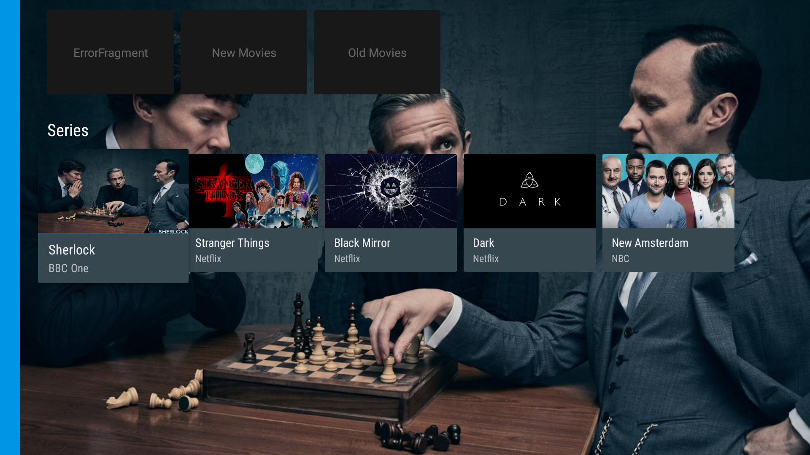
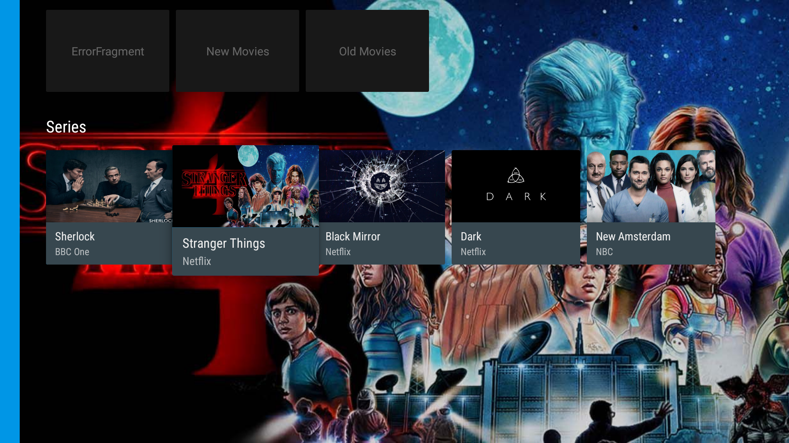
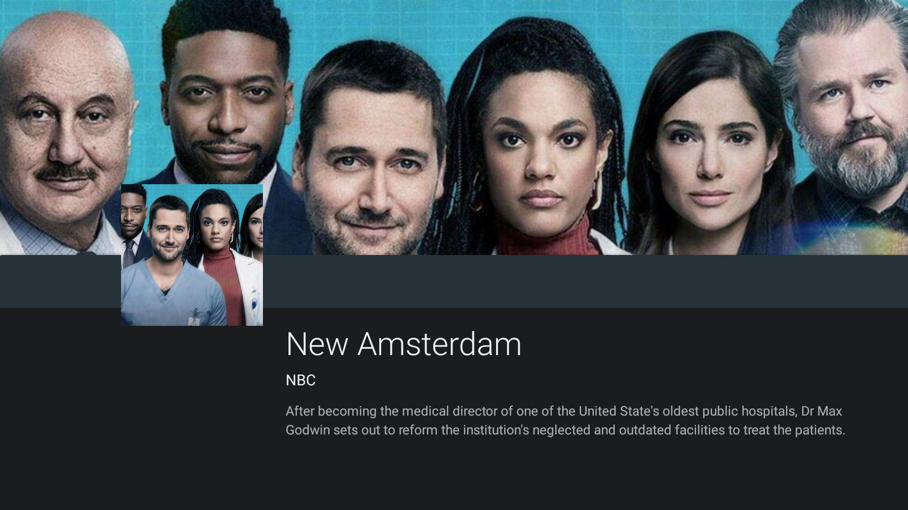

# Android TV App

[](https://github.com/halilozel1903/AndroidTVApp/actions/workflows/android-ci.yml)
[](LICENSE)
[](https://openjdk.org/)
[](https://developer.android.com/jetpack/androidx/releases/leanback)

[](app/build.gradle)
[](app/build.gradle)
[](app/build.gradle)
[](build.gradle)
[](gradle/wrapper/gradle-wrapper.properties)

Sample [AndroidX Leanback](https://developer.android.com/training/tv/start/start) app for Android TV: browse rows, poster cards, a details screen with related items, and D-pad–friendly navigation. Use it to learn TV UI patterns—not as a production streaming product.

### Scope

| Included | Not included |
|----------|----------------|
| Leanback browse home (Movies grid + Series card row) | Video playback, DRM, or live streaming |
| Details screen with related-videos row (sample data) | User accounts, auth, or a backend API |
| Sample catalog in [`app/src/main/assets/catalog.json`](app/src/main/assets/catalog.json) with bundled posters | Production content licensing or CDN integration |
| Focus-driven backgrounds via `PicassoBackgroundManager` | Kotlin, Compose, or multi-module architecture |
| Sample error screen from the Movies row | Analytics, ads, or store distribution setup |

## Features

- **Browse home** — Leanback `BrowseFragment` with a *Movies* text grid row and a *Series* card row.
- **Details** — Full-width overview for a selected series, plus a related-videos row (sample data).
- **Dynamic backgrounds** — Background art updates when rows and cards are focused (`PicassoBackgroundManager`).
- **Error flow** — Selecting *ErrorFragment* in the Movies row opens a sample error screen.
- **TV-only** — Declares `leanback` as required and uses the `LEANBACK_LAUNCHER` intent category.

## Requirements

| Tool | Version |
|------|---------|
| JDK | 17 |
| Android Gradle Plugin | 8.7.3 (`build.gradle`) |
| Gradle | 8.9 (wrapper) |
| Android SDK | API 35 (`compileSdk` / `targetSdk`) |
| Minimum device API | 24 |

Install [Android Studio](https://developer.android.com/studio) (recommended) or the [command-line SDK tools](https://developer.android.com/studio#command-tools). Set `sdk.dir` in `local.properties` (Android Studio creates this automatically).

## Setup

1. Clone the repository.
2. Open the project in Android Studio, or ensure `local.properties` points at your SDK:

   ```properties
   sdk.dir=/path/to/Android/sdk
   ```

3. Sync Gradle and download dependencies.

## Build and run

### Command line

```bash
./gradlew assembleDebug
```

The debug APK is written to `app/build/outputs/apk/debug/`.

Release build (signing is optional; see [Release signing](#release-signing)):

```bash
./gradlew assembleRelease
```

### Android TV emulator

1. In Android Studio: **Tools → Device Manager → Create device**.
2. Choose a **TV** hardware profile (for example Android TV (1080p)).
3. Select a system image with API 24 or higher (API 35 matches this project).
4. Run the **app** configuration on the TV emulator.

### Physical Android TV

Enable [developer options and USB debugging](https://developer.android.com/studio/debug/dev-options) on the device, connect via ADB, and install the debug APK:

```bash
adb install app/build/outputs/apk/debug/app-debug.apk
```

The app appears in the Android TV launcher under **AndroidTVTutorial** (see `app_name` in `strings.xml`).

## Architecture overview

```
MainActivity
  └── MainFragment (BrowseFragment)
        ├── Movies row — grid text items (includes ErrorFragment demo)
        └── Series row — Movie cards → DetailsActivity

DetailsActivity
  └── VideoDetailsFragment (DetailsFragment)
        ├── Details overview (poster, title, studio, description)
        └── Related videos row (sample Movie list)

ErrorActivity
  └── ErrorFragment (sample error UI)
```

| Component | Role |
|-----------|------|
| `MainFragment` | Builds browse rows and handles focus / click navigation. |
| `MovieCatalog` | Loads series metadata and poster URLs from `assets/catalog.json`. |
| `CardPresenter` | Leanback presenter for series poster cards. |
| `VideoDetailsFragment` | Loads poster bitmaps on a background executor and builds the details UI. |
| `PicassoBackgroundManager` | Cross-fades background images on the browse and details screens. |
| `Movie` | Serializable model passed to the details screen via intent extras. |

Package: `com.example.androidtvapp`. Application ID: `com.example.androidtvapp` (configurable in `app/build.gradle`).

## Configuration

- **App label** — `app/src/main/res/values/strings.xml` (`app_name`).
- **Sample content** — Edit `app/src/main/assets/catalog.json` and files under `app/src/main/assets/posters/`. See [docs/SAMPLE_CONTENT.md](docs/SAMPLE_CONTENT.md).
- **Theming** — Leanback theme in `res/values/styles.xml` and colors in `colors.xml`.
- **ProGuard** — Rules in `app/proguard-rules.pro` (minification is off for release in the default config).

### Release signing

Debug builds use the default debug keystore. Release builds are unsigned until you configure signing:

1. Copy `keystore.properties.example` to `keystore.properties` (gitignored) and fill in paths and passwords, **or**
2. Export `ANDROID_KEYSTORE_PATH`, `ANDROID_KEYSTORE_PASSWORD`, `ANDROID_KEY_ALIAS`, and `ANDROID_KEY_PASSWORD`.

Do not commit keystores or passwords. Generate your own release keystore locally when you publish.

## Screenshots

Browse and details flows on Android TV:

| Movies browse | Series row |
|---------------|------------|
|  |  |

| Series cards | Details |
|--------------|---------|
|  |  |

Additional captures: `docs/screenshots/`.

## Contributing

Issues and pull requests are welcome. For larger changes, open an issue first to discuss scope. Keep changes focused and match existing Java / Leanback patterns.

## License

This project is licensed under the MIT License. See [LICENSE](LICENSE).

## Acknowledgments

Bundled posters and optional network fallbacks are documented in [docs/SAMPLE_CONTENT.md](docs/SAMPLE_CONTENT.md). Replace sample art with licensed assets in derivative work.
