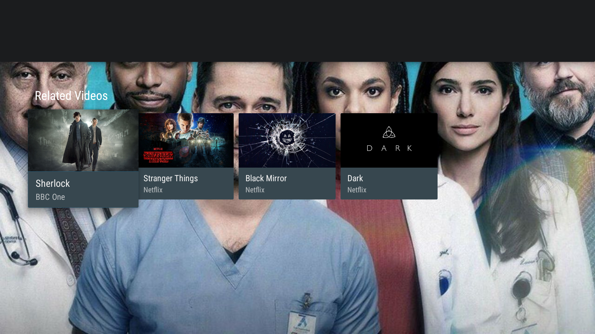

# Android TV App 📺


Android TV is a version of the Android operating system. It is developed by Google for soundbars, set-top boxes, digital media players, and TVs with native applications. It is a replacement for Google TV. The Android TV platform was first launched in June 2014.This platform has also been adopted as smart TV middleware by a company such as Sharp and Sony.

Build apps that let users experience your app's immersive content on the big screen. Users can discover your content recommendations on the home screen, and the leanback library provides APIs to help you build a great use experience for a remote control.


## App Screenshots 📸

TV celebrates content by making it front and center. Whether you’re looking for movies, games, or TV, it’s about finding and enjoying content with the least amount of friction.
TV is colorful, guided by ambient movement, with immediate access to content. These qualities define the experience of TV and form the foundation of Android TV’s design.

### Movies 🎬


### Series Screens 🎥


### Series Detail Screens 🕵🏻‍♀️





### Series Related Videos 🍿


## License ℹ️
```
MIT License

Copyright (c) 2022 Halil OZEL

Permission is hereby granted, free of charge, to any person obtaining a copy
of this software and associated documentation files (the "Software"), to deal
in the Software without restriction, including without limitation the rights
to use, copy, modify, merge, publish, distribute, sublicense, and/or sell
copies of the Software, and to permit persons to whom the Software is
furnished to do so, subject to the following conditions:

The above copyright notice and this permission notice shall be included in all
copies or substantial portions of the Software.

THE SOFTWARE IS PROVIDED "AS IS", WITHOUT WARRANTY OF ANY KIND, EXPRESS OR
IMPLIED, INCLUDING BUT NOT LIMITED TO THE WARRANTIES OF MERCHANTABILITY,
FITNESS FOR A PARTICULAR PURPOSE AND NONINFRINGEMENT. IN NO EVENT SHALL THE
AUTHORS OR COPYRIGHT HOLDERS BE LIABLE FOR ANY CLAIM, DAMAGES OR OTHER
LIABILITY, WHETHER IN AN ACTION OF CONTRACT, TORT OR OTHERWISE, ARISING FROM,
OUT OF OR IN CONNECTION WITH THE SOFTWARE OR THE USE OR OTHER DEALINGS IN THE
SOFTWARE.
```
